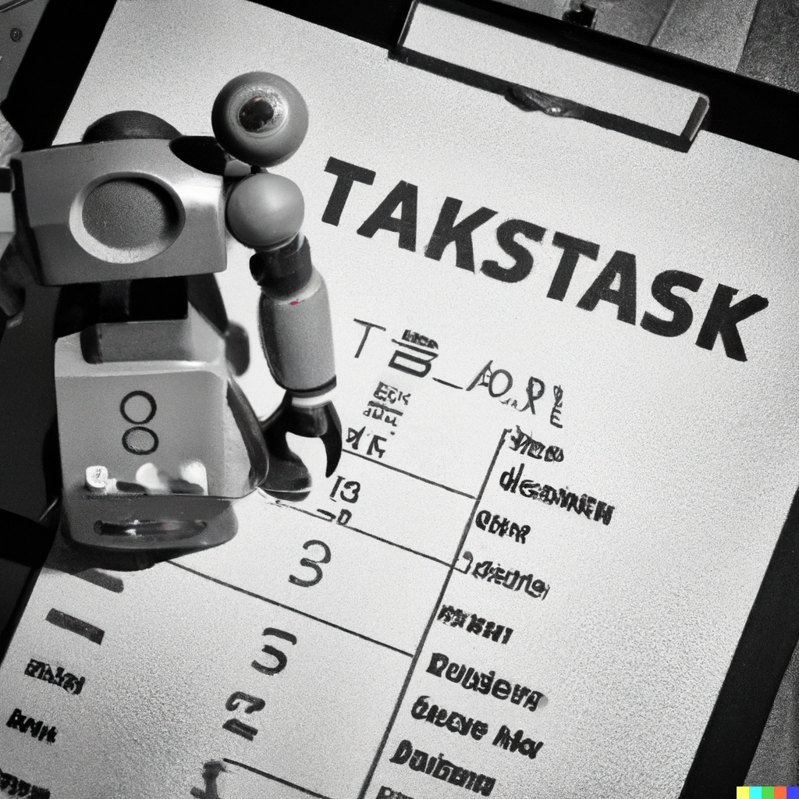
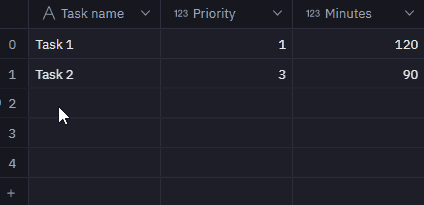
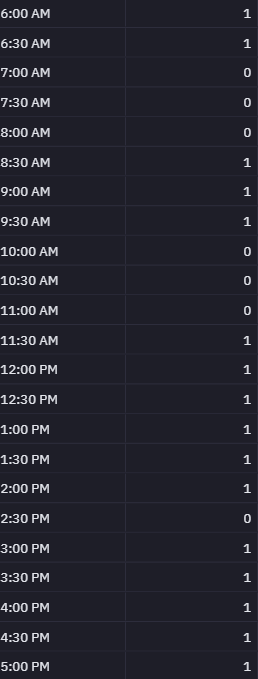
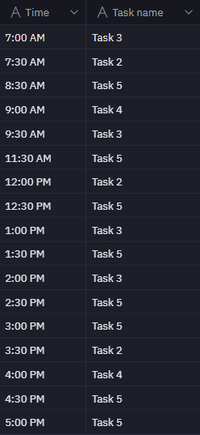

# Daily Task Scheduling with Hex and PuLP

## Problem

Off-the-shelf work management tools, like Monday.com, Trello and others have a lot of capabilities for observing and managing workloads.  But because they try to "do everything for everyone", they often fall short in some specific use cases.  One such case from my own perspective, is in scheduling tasks within a given day based on priority and expected duration.  Show me a work management tool that can do that - take my tasks, their priority levels, expected durations and my calendar as inputs, then tell me which task to do first, next, etc.  - and I'll subscribe for life.  Unfortunately, no such tool exists.  Fortunately, I can create my own.  

## The Hex Notebook

This notebook extends an idea and set of code by [Khuyen Tran](https://medium.com/towards-data-science/maximize-your-productivity-with-python-6110004b45f7), which leverages the python linear programming library [PuLP](https://coin-or.github.io/pulp/).  My extension is by way of an implementation of the code in [Hex](https://hex.tech/).  Hex notebooks are an excellent tool for building apps with Python and SQL. They allow for seamless integration of code and visualizations in one place. Hex's data connectivity, collaboration features, and efficiency make it a game-changing platform for data scientists.  I am not affiliated with Hex, but I am a very happy customer.  

## Table Inputs

Hex apps can accommodate input widgets like buttons, date pickers and dropdowns to make interacting with notebook logic easy.  One of these input widgets is called the "table input".  Table inputs allow app users to enter their own dataframes on the fly, so that downstream code can leverage these to perform logic.  Here, we'll use two table inputs:   

### Step 1: Enter your Task List

Enter your current tasks, along with a priority level (larger numbers have higher priority than smaller numbers) and expected duration.  Since this is a daily task planner, I'll use minutes, but the code can be easily adapted for longer horizons where hours or even days could be used.

### Step 2: Enter your Schedule

Enter your schedule for the day, or more specifically, your availability (1 = available) during each 1/2 hour time block.  If you're working with longer time horizons, your time blocks can be hours or even days.

### Extracted Variables

From the inputs above, we can extract the necessary variables needed for the optimization.  Those are $s_i$ (the priority of task $i$), $d_i$ (the number of 30-minute time blocks needed to finish task $i$), $b_t$ (the availability of the time block, where $b\in\{0,1\}$ 1 = not available), $B$ (total number of time blocks), and $n$ (total number of tasks).  

    # Declare variables for optimization
    s = list(task['Priority'])
    d = list(task['Num of blocks'])
    b = list(schedule)
    B = len(b)
    n = len(s)
    A = sum(b)

## Model Objective

PuLP is a linear programming library, the goal of which is to maximize (or minimize) an objective function.  In our case, the objective is to maximize productivity, as approximated by the numerical priority score assigned in the task list table input above, by deciding whether or not to assign the task in a specific block of time.

$\text{Maximize} \;\; \sum_{i=1}^{n}\sum_{t=1}^{B} s_{i}y_{it}$

where $y_{it}$ = 1 if task $i$ is assigned to time $t$, 0 otherwise

    # Import PuLP
    from pulp import *

    # Define the problem
    prob = LpProblem("Schedule_Tasks", LpMaximize)

    # Define y
    y = LpVariable.dicts('Block', [(i, t) for i in range(n) for t in range(B)], cat = 'Binary')

    # Definite objective function
    prob += lpSum(s[i]*b[t]*y[(i,t)] for i in range(n) for t in range(B))

## Constraints

The optimization needs to adhere to the following constraints:

1. The number of time blocks with assigned tasks should be not greater than the number of available time blocks

    $\sum_{i=1}^{n}\sum_{t=1}^{B} y_{it} \leq A$

2. The number of time blocks assigned for each task should not be greater than the time needed to finish the task

    $\sum_{t=1}^{B} y_{it} \leq d_i \;; \forall i = 1, 2, ..., n$

3. No more than one task should be assigned to each time block

    $\sum_{i=1}^{n} y_{it} \leq 1 \;; \forall t = 1, 2, ..., B$

 

    # Constraint #1
    prob += lpSum(y[(i,t)] for i in range(n) for t in range(B)) <= A

    # Constraint #2
    for i in range(n):
        prob += lpSum(y[(i,t)] for t in range(B)) <= d[i]

    # Constraint #3
    for t in range(B):
        prob += lpSum(y[(i,t)] for i in range(n)) <= 1

To solve the problem, we invoke `prob.solve()`.  In the Hex notebook, we can configure the App run settings to wait for an app user to click a run button.  That button is in the upper right corner of the Hex app.  

## Output

In order to collect output from the optimization, we can append each task and time block to a dataframe.

    import pandas as pd
    tasks_blocks = pd.DataFrame(columns=['Task', 'Block'])

    for i in range(n):
        for t in range(B):
            if y[(i,t)].varValue == 1:
                tasks_blocks = pd.concat([tasks_blocks, pd.DataFrame({'Task': [i], 'Block': [t]})], ignore_index=True)

And I'll cast `Task` and `Block` in the dataframe as integers

    tasks_blocks['Task'] = tasks_blocks['Task'].astype(int)
    tasks_blocks['Block'] = tasks_blocks['Block'].astype(int)

In order to view output against the original input tables (i.e. to see the Task name and Time block), I will add a `task_id` and `block_id` to the Task and Available_Block tables, respectively

    task['task_id'] = range(len(task))
    available_blocks['block_id'] = range(len(available_blocks))

And then join the three tables to show the results

    SELECT
    available_blocks."Time",
    task."Task name"

    FROM 
    tasks_blocks 
    INNER JOIN task ON tasks_blocks.Task = task.task_id
    INNER JOIN available_blocks ON tasks_blocks.Block = available_blocks.block_id

The following table lists each time block and task that should be completed today in order to maximize producitivity, based on the inputs above:

Feel free to view and play around with the [Hex app](https://app.hex.tech/2737cf3a-31c1-4361-9f90-8dea0b629cf0/app/437a96da-594f-4950-9a79-5386bbaefc8c/latest)!  And thanks for reading!